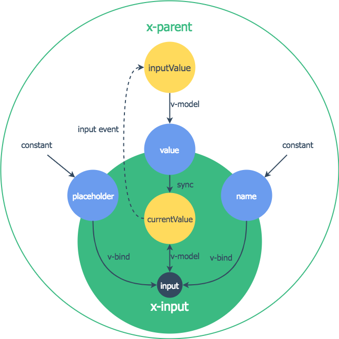

## Vue篇


### 使用`v-bind`和`v-on`的快捷方法

:::RULE
Vue 为`v-bind`和`v-on`指令提供了两个快捷方法，虽然这看起来和普通的HTML风格不一样，但是`:`和`@`字符也是可以作为HTML属性名的。

推荐优先使用它们，这可以大大提高写代码的速度以及代码的可读性。

```html
<!-- 错误例子1 -->
<a v-on:click="doSomething"></a>
<!-- 正确例子1 -->
<a @click="doSomething"></a>

<!-- 错误例子2 -->
<a v-bind:href="url"></a>
<!-- 正确例子2 -->
<a :href="url"></a>
```
:::


### 简化`props`的类型

:::RULE

Vue组件的`props`是其最重要的对外API，推荐在设计这些`props`时尽量确保它们的类型简化，不要使用一个非常复杂的对象或者数组。尽量确保其`props`类型是字符串、数字、布尔值之类的基本类型，即使真的需要用到对象和数组，也可以尽量简化其内部项的类型。

这么设计有几个好处：

1. 属性分离，可以使得`props`有更好的语义化、功能更加清晰、易于理解
2. 基本类型的`props`可以直接在模板中作为字面量使用。但如果是对象和函数类型的字面量，那么因为模板每次都会重新生成`props`值，相当于每次渲染时得到的`props`是不同的，会导致`watch`回调函数的不必要触发

但是也并不是所有的组件都一定要使用基本类型的`props`，如果基本类型并不能满足需求或者并不是特别好用，那么还是推荐使用对象或数组类型。

举个例子，`tab`组件的可选tab数据更多是当前页面固定不变的，而`tree`的可选值数据更多的是动态输出（存储在后端）的。所以推荐`tab`组件的可选tab数据使用简单类型，而`tree`使用数组类型。

```html
<!-- 正确例子 -->
<x-tabs value="3">
    <x-tab value="1">首页</x-tab>
    <x-tab value="2">动画</x-tab>
    <x-tab value="3">电影</x-tab>
    <x-tab value="4">电视剧</x-tab>
    <x-tab value="5">其他</x-tab>
</x-tabs>

<x-tree :value="selectedProductionId" :options="productionTree"></x-tree>
```
:::


### `props`和`data`

:::RULE

Vue 的`props`和`data`配置有点相似，但又完全不一样。**`props`其实是组件对外部的属性接口，而`data`是组件内部的可变状态。**

从Vue 2.0开始，`props`便不能通过`this.prop = newValue;`的赋值方式来修改（在debug模式下会报错），必须在组件外部通过属`v-bind/v-model`指令的方式由父组件传递过来新的值。而`data`则是可以在组件内外部来直接用Javascript赋值来修改的，不过很少会在组件外直接修改组件的`data`值。

所以我们已经可以得到如下几个结论：

1. 如果这个状态不应该被组件外部修改，则只使用`data`
2. 如果这个状态应该被组件外部修改
    1. 如果这个状态不会被内部修改（用户交互或其他原因导致），则只使用`props`
    2. 如果这个状态会被内部修改，则需要同时使用`data`和`props`

因为`props`和`data`不能同名，所以必须要区分一下。我们来看一个简单的输入框组件`x-input`的案例。

输入框的值即需要被外部组件控制修改，也同时需要能够让用户键盘输入来修改。所以定义了一个`props`名为`value`被外部使用，再定义一个`currentValue`作为`data`被内部修改。具体结构看下图：



绿色为组件实例，蓝色为`props`，黄色为`data`。初始化时`currentValue`的值会被赋值为`value`的值，并watch `value`值变化，如果外部修改`inputValue`则会立即更新`currentValue`。如果用户输入，则会更新`currentValue`并触发`input`事件然后通知`inputValue`新的值。

这里会有一个死循环在内部，但是由于Vue的watch机制是在值发生变化（===）时才触发回调，所以不存在问题。所以你需要确保一个状态不应该有多个不同的引用值。

```html
<!-- x-container -->
<template>
    <x-input name="username" v-model="inputValue"></x-input>
    <div>{{inputValue}}</div>
</template>
<script>
    export default {
        name: 'XContainer',
        data() {
            return {
                inputValue: '输入框文字'
            };
        }
    }
</script>

<!-- x-input -->
<template>
    <span class="x-input">
        <input class="x-input__txt" :name="name" v-model="currentValue"></input>
    </span>
</template>
<script>
    export default {
        name: 'XInput',
        props: {
            name: String,
            value: [String, Number]
        },
        data() {
            return {
                currentValue: this.value
            };
        },
        watch: {
            value(nextValue) {
                this.currentValue = nextValue;
            },
            currentValue(nextValue) {
                this.$emit('input', nextValue);
            }
        }
    }
</script>
```
:::
